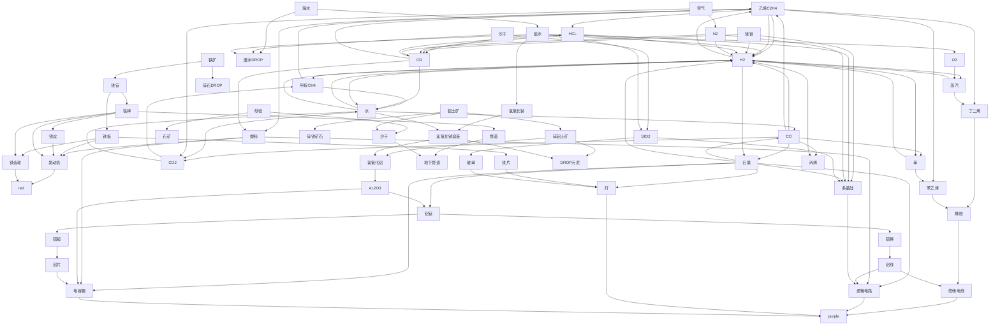

#### Nullius

##### plan
> 现在的目标不是精准完美的计算，而是protype。细节考虑点到为止。分几个方面：1. 基建 2. workflow的正常运行 

###### 基建
1. 气体类的主要工具是化工厂，固体(铁相关)主要是熔炉/铸造厂。red之后的组装机。破碎机(可手搓，搞沙子用，估计需求不大)
2. 气体回收和废水回收(得搜一下)
3. 管道，需要大量。

###### wf

1. 先到red再看以后的科技树

## 计算和目标

### 目标

1. 现在的目标有3个 --> 
   1. 计算。计算到purple为止需要的red yellow blue，进而从结构上module化remake
   2. red有很多新的产品，产品使用需要熟悉。
   3. 基础建设的增加。
      1. 矿需要很多采矿机(根据planner来计算)
      2. 需要组装机/机械臂/传送带/铁齿轮/铁板/铁棒/管道 --> 估计算是结构上的第二层，设计时，留“自己都无法想象的空隙”
      3. 开地图？

### 计算

- red 317
  - 
- yellow 265
- blue 247

### TODO
- [ ] 更新mermaid 图，加到purple done
- [ ] planner mod加上，并且计算到purple done

---

purple这步的流体和固体混合自动化很难。为了形成集中的流水线，估计后期得用铁路运矿。
基础建设随着层数的提高变得需要升级基建设备，进而提高效率。

---

目前在开发purple上达到了bottleneck。

比如塑料作为上层产物达到了* 5倍的需求倍增。随着新设备的增加，合成气体(比如乙烯,它在purple主要是橡胶的底层产物，量必然无法通过塑料来分。同样，塑料的wf也需要module化，使得无bottleneck)的方式变得多元。不必在old pattern下remake。

找新的空间按照向外扩展的方向继续设计。

### TODO

1. 铝土矿/塑料生产线扩张。
2. **purple自动化**
   1. 石墨的补给
   2. 四个产物的连接
   3. 计算需要多少purple

---

## TODO
1. 开一条铁片的自动化 --> 灯
2. 石墨自动化
3. 塑料扩展
4. 铝的扩展
5. 红瓶的塑料补给
6. 开地图（有车了！！