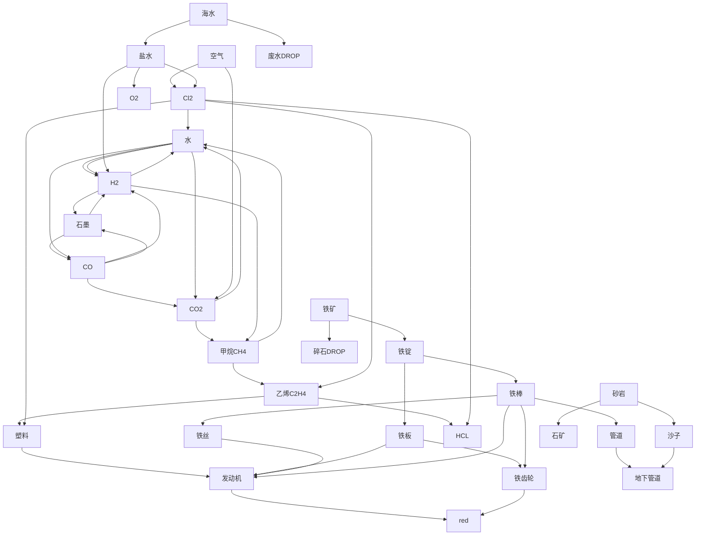

#### Nullius

##### plan
> 现在的目标不是精准完美的计算，而是protype。细节考虑点到为止。分几个方面：1. 基建 2. workflow的正常运行 

###### 基建
1. 气体类的主要工具是化工厂，固体(铁相关)主要是熔炉/铸造厂。red之后的组装机。破碎机(可手搓，搞沙子用，估计需求不大)
2. 气体回收和废水回收(得搜一下)
3. 管道，需要大量。

###### wf

1. 先到red再看以后的科技树

## 计算和目标

### 目标

1. 现在的目标有3个 --> 
   1. 计算。计算到purple为止需要的red yellow blue，进而从结构上module化remake
   2. red有很多新的产品，产品使用需要熟悉。
   3. 基础建设的增加。
      1. 矿需要很多采矿机(根据planner来计算)
      2. 需要组装机/机械臂/传送带/铁齿轮/铁板/管道 --> 估计算是结构上的第二层，设计时，留“自己都无法想象的空隙”
      3. 开地图？

### 计算

### TODO
1. 更新mermaid 图，加到purple
2. planner mod加上，并且计算到purple