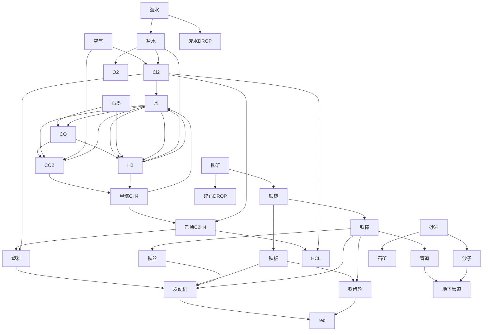

#### Nullius

##### plan
> 现在的目标不是精准完美的计算，而是protype。细节考虑点到为止。分几个方面：1. 基建 2. workflow的正常运行 

###### 基建
1. 气体类的主要工具是化工厂，固体(铁相关)主要是熔炉/铸造厂。red之后的组装机。破碎机(可手搓，搞沙子用，估计需求不大)
2. 气体回收和废水回收(得搜一下)
3. 管道，需要大量。

###### wf

1. 先到red再看以后的科技树

